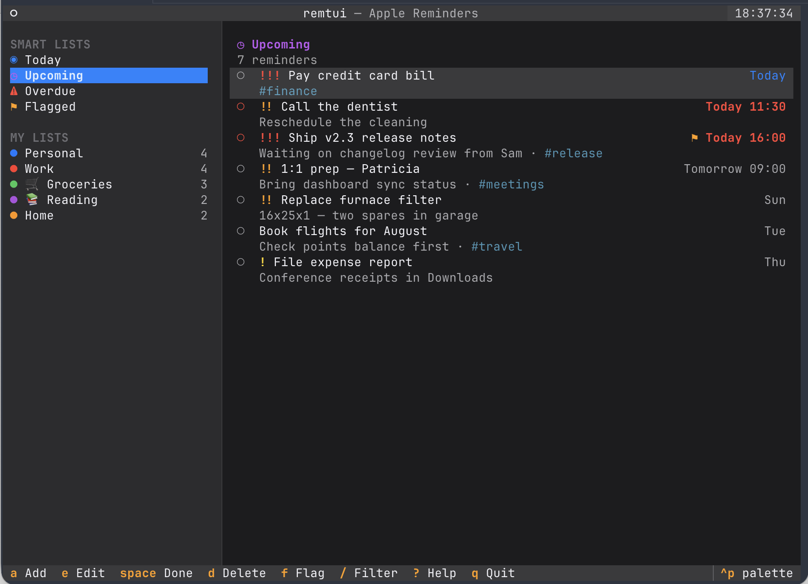

# remtui

A fast, keyboard-driven TUI for **Apple Reminders**, built with
[Textual](https://github.com/Textualize/textual) on top of
[remctl](https://github.com/viticci/remctl).

Browse your lists in a colored sidebar, work through smart views (Today,
Upcoming, Overdue, Flagged), and do full CRUD on reminders — add, edit,
complete, flag, and delete — without leaving the terminal. Mouse works
everywhere too.



## Requirements

- macOS with Apple Reminders
- [remctl](https://github.com/viticci/remctl) installed and onboarded:

  ```bash
  git clone https://github.com/viticci/remctl.git
  cd remctl && ./install.sh --bootstrap
  remctl onboard
  remctl permissions full-disk-access   # recommended for fast reads
  remctl doctor
  ```

- Python 3.12+ and [uv](https://docs.astral.sh/uv/)

## Install

```bash
./install.sh
remtui
```

The install script syncs the project environment with uv and drops a
`remtui` launcher into the same directory as your `remctl` binary
(e.g. `~/bin`), falling back to `~/.local/bin` if remctl isn't found.
Use `--dir DIR` to pick a location explicitly, `--uninstall` to remove it,
and re-run `./install.sh` after a `git pull` to update.

You can also skip installation and run from the checkout:

```bash
uv sync
uv run remtui
```

No remctl yet? Try the built-in demo backend (a fake reminders store, full
CRUD, no permissions needed):

```bash
uv run remtui --demo
```

Point at a specific remctl binary with `--remctl /path/to/remctl` or
`REMTUI_REMCTL=/path/to/remctl`.

## Keys

| Key | Action |
| --- | --- |
| `j`/`k`, `↑`/`↓` | move |
| `←`/`h` / `→`/`l`, `tab` | switch between sidebar and reminders |
| `g` / `G` | top / bottom |
| `a` / `n` | add reminder |
| `e` / `enter` | edit selected |
| `space` | toggle done |
| `d` / `⌫` | delete (asks first) |
| `f` | toggle flag |
| `p` | cycle priority |
| `/` | filter current view (`esc` clears) |
| `c` | show/hide completed (list views) |
| `r` | refresh |
| `ctrl+p` | command palette (switch themes, …) |
| `?` | help |
| `q` | quit |

Due dates in the add/edit form accept remctl's formats: `2026-08-01`,
`tomorrow 09:30`, `today at 3pm`, `fri 15:00`, `+3d` — leave blank for none;
clearing the field on edit removes the due date. In the add/edit form,
`ctrl+e` opens the notes field in your `$EDITOR` (vim by default).

### Configuration

`~/.config/remtui/config.toml` (created with commented defaults on first
run; honors `XDG_CONFIG_HOME`):

```toml
[keys]
profile = "vim"            # "default" or "vim"
"reminder.add" = "a,n"     # optional per-binding overrides by binding id
```

An override replaces the binding's keys entirely (comma-separate to keep
several). Binding ids: `reminder.add`, `reminder.edit`, `reminder.done`,
`reminder.delete`, `reminder.flag`, `reminder.priority`, `view.filter`,
`view.show-completed`, `view.refresh`, `view.dismiss-filter`, `app.help`,
`app.quit`, `nav.up`, `nav.down`, `nav.left`, `nav.right`, `nav.top`,
`nav.bottom`, `nav.switch-pane`, `vim.half-down`, `vim.half-up`,
`vim.page-down`, `vim.page-up`, `vim.palette`, `vim.new`.

### Vim profile

Enable with `--vim`, `REMTUI_KEYS=vim`, or `profile = "vim"` in the config
(the flag wins) for a few extra vim-style motions:

| Key | Action |
| --- | --- |
| `gg` / `G` | jump to top / bottom (single `g` waits for the chord) |
| `ctrl+d` / `ctrl+u` | half page down / up |
| `ctrl+f` / `ctrl+b` | full page down / up |
| `:` | command palette |
| `o` | add a reminder |

## Development

```bash
uv run pytest                          # full suite (unit + pilot-driven TUI tests)
uv run textual run --dev -c remtui --demo   # run under Textual devtools
```

The test suite and `--demo` mode run against `remtui/fake_remctl.py`, a
faithful emulation of remctl's JSON contract backed by a JSON state file
(`$REMTUI_FAKE_STATE`, default `~/.cache/remtui/demo.json`).

## Architecture

- `remtui/client.py` — async subprocess wrapper around `remctl … --json`;
  reads run concurrently, mutations are serialized (EventKit writes race).
- `remtui/models.py` — dataclasses mirroring remctl's JSON schemas.
- `remtui/app.py` — the Textual app: sidebar (smart views + lists), reminder
  pane, workers for loading and mutations.
- `remtui/screens.py` — modal add/edit form, delete confirmation, help.
- `remtui/widgets.py` — reminder rows, sidebar options, view header.

## Acknowledgements

remtui exists because of [remctl](https://github.com/viticci/remctl), the
excellent Apple Reminders CLI by [Federico Viticci](https://www.macstories.net).
Everything hard about talking to Reminders — fast reads straight from the
local store, writes that respect iCloud sync, sections, tags, smart lists,
and a clean, scriptable JSON interface designed with automation and AI
agents in mind — is remctl's work. This project is just a friendly terminal
face on top of it.

If you find remtui useful, the thanks belong upstream: go star remctl, and
check out Federico's writing at [MacStories](https://www.macstories.net).
Thank you, Federico, for building such a thoughtful, well-crafted tool and
sharing it with the community.
